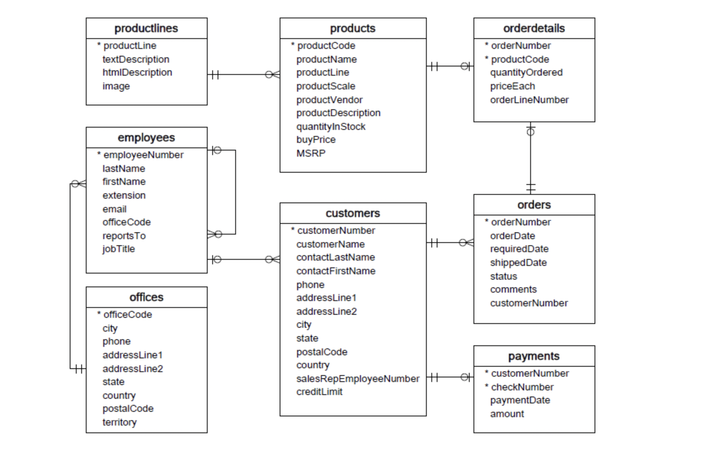

This repository contains SQL code for analyzing stores.db, a sales
records database for scale model cars.

### Database Schema for stores.db

Please do the following to use locally:
* Download and install [DB Browser for SQLite](https://sqlitebrowser.org/dl/)
* Open stores.db with DB Browser
* Go to the `Execute SQL` tab to execute code from KPI.sql
